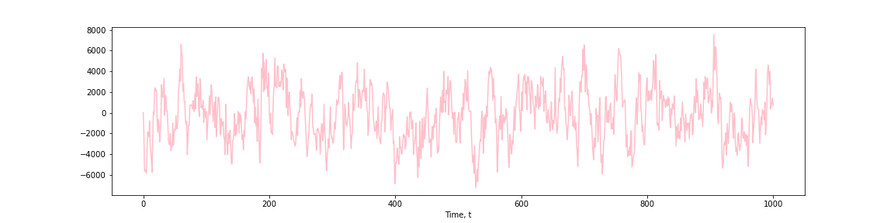

[](http://quantlet.de/)

## [](http://quantlet.de/) **Pink_Noise** [](http://quantlet.de/)

```yaml

Name of Quantlet: Pink_Noise

Published in: Quantlet

Description: ‘Spectral Analysis´

Keywords: Pink Noise, ACF, PACF 

Author: Maria Culjak 
```

